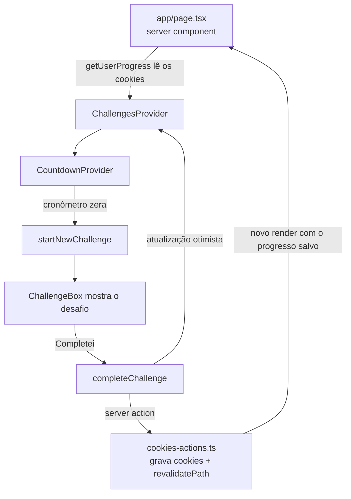

# Move.it 2

Aplicação de produtividade que combina a técnica Pomodoro com gamificação. Ao fim de cada ciclo de foco, o app sorteia um desafio rápido de alongamento ou descanso para os olhos. Completar o desafio rende pontos de experiência (xp), que fazem o usuário subir de level.

Feito com Next.js 16 (App Router), React 19, TypeScript (strict) e Tailwind CSS v4.

## Como funciona

1. O usuário clica em **Iniciar ciclo** e o cronômetro de 35 minutos começa a contar.
2. Quando o cronômetro chega a zero, um desafio é sorteado, um som toca e (se o navegador já tiver permissão) uma notificação é exibida.
3. O usuário responde ao desafio:
   - **Completei**: ganha o xp do desafio e o contador de desafios completos aumenta.
   - **Falhei**: o desafio é descartado, sem xp.
4. Nos dois casos o cronômetro volta para 35 minutos, pronto para um novo ciclo.
5. Se o xp acumulado atingir a meta do level atual, o usuário sobe de level e um modal de parabéns aparece.

Durante um ciclo ativo, **Abandonar ciclo** zera o cronômetro sem gerar desafio.

### Regras de experiência

A meta de xp para sair de um level é:

```
xp necessário = ((level + 1) * 4)²
```

| Level atual | xp para o próximo |
| ----------- | ----------------- |
| 1           | 64                |
| 2           | 144               |
| 3           | 256               |
| 4           | 400               |

Ao subir de level, o xp excedente é carregado para o level seguinte. Cada desafio completo sobe no máximo um level.

### Desafios

São 12 desafios, definidos em [src/lib/challenges-data.ts](src/lib/challenges-data.ts), cada um com:

| Campo         | Descrição                                             |
| ------------- | ----------------------------------------------------- |
| `type`        | `'body'` (alongamento) ou `'eye'` (descanso visual)   |
| `description` | Instrução exibida ao usuário                          |
| `amount`      | xp concedido ao completar (de 50 a 140)               |

O `type` também define o ícone exibido (`public/icons/body.svg` ou `public/icons/eye.svg`). Para adicionar um desafio, basta incluir um novo item nesse array.

## Rodando o projeto

O gerenciador de pacotes é o **pnpm** (não use npm, yarn ou bun).

```bash
pnpm install
pnpm dev
```

A aplicação fica disponível em [http://localhost:3000](http://localhost:3000).

| Comando             | O que faz                          |
| ------------------- | ---------------------------------- |
| `pnpm dev`          | Servidor de desenvolvimento        |
| `pnpm build`        | Build de produção                  |
| `pnpm start`        | Sobe o build de produção           |
| `pnpm lint`         | Biome (lint + formatação)          |
| `pnpm lint:fix`     | Biome com correção automática      |
| `pnpm exec tsc --noEmit` | Checagem de tipos                  |

O projeto não tem testes automatizados. Antes de subir uma alteração, rode `pnpm lint && pnpm exec tsc --noEmit`.

Não é necessário configurar variáveis de ambiente: não há banco de dados, e a `DATABASE_URL` do `.env` não é usada.

## Estrutura

```
app/
  layout.tsx        Layout raiz: fontes (Inter, Rajdhani) e metadata
  page.tsx          Página única; carrega o progresso e monta os providers
  globals.css       Tailwind v4 e tokens de tema (variáveis CSS)
src/
  components/       Componentes de interface
  contexts/         Estado da aplicação (React Context)
  lib/              Dados dos desafios e server actions de cookies
public/
  icons/            Ícones SVG
  notification.mp3  Som tocado quando um desafio é sorteado
```

O alias `@/*` aponta para a raiz do repositório, então os imports ficam `@/src/components/...`.

### Componentes

| Componente                                                         | Responsabilidade                                              |
| ------------------------------------------------------------------ | ------------------------------------------------------------- |
| [experience-bar.tsx](src/components/experience-bar.tsx)             | Barra de progresso do xp no level atual                       |
| [profile.tsx](src/components/profile.tsx)                           | Avatar, nome e level do usuário                               |
| [completed-challenges.tsx](src/components/completed-challenges.tsx) | Total de desafios completos                                   |
| [countdown.tsx](src/components/countdown.tsx)                       | Mostrador do cronômetro e botão de iniciar/abandonar ciclo    |
| [challenge-box.tsx](src/components/challenge-box.tsx)               | Desafio ativo com os botões **Falhei** e **Completei**        |
| [level-up-modal.tsx](src/components/level-up-modal.tsx)             | Modal exibido ao subir de level                               |
| [foco-atual.tsx](src/components/foco-atual.tsx)                     | Foco atual da tela Hoje e botão **Iniciar ciclo**             |
| [pilares.tsx](src/components/pilares.tsx)                           | Itens de Estabilidade, Crescimento e Laboratório; escolher o foco |
| [inbox.tsx](src/components/inbox.tsx), [captura-rapida.tsx](src/components/captura-rapida.tsx) | Inbox: captura rápida e triagem para um pilar |

## Arquitetura

### Fluxo de dados



### Estado

O estado vive em dois contextos, ambos `'use client'`:

- **[ChallengesProvider](src/contexts/challenges-context.tsx)**: guarda o progresso do usuário (level, xp, desafios completos), o desafio ativo e a abertura do modal de level up. O progresso vem do servidor e é envolvido em `useOptimistic`: ao completar um desafio, a interface atualiza na hora e a server action persiste o resultado em segundo plano.
- **[CountdownProvider](src/contexts/countdown-context.tsx)**: controla o cronômetro (tempo restante, ativo, encerrado). Fica dentro do `ChallengesProvider` porque chama `startNewChallenge` quando o tempo acaba.

### Persistência

Não há banco de dados. O progresso é salvo em três cookies, `level`, `currentExperience` e `challengesCompleted`, por meio das server actions de [src/lib/cookies-actions.ts](src/lib/cookies-actions.ts):

| Action               | O que faz                                                           |
| -------------------- | ------------------------------------------------------------------- |
| `getUserProgress`    | Lê os cookies; sem cookies, retorna level 1, 0 xp e 0 desafios      |
| `completeChallenge`  | Soma o xp, aplica o level up se for o caso e grava o novo progresso |
| `updateUserProgress` | Grava os campos informados e chama `revalidatePath('/')`            |
| `levelUp`            | Incrementa o level (não é usada pela interface hoje)                |

O Sistema M (pilares, foco atual e Inbox; ver [05-sistema-m.md](docs/specs/05-sistema-m.md)) não usa cookies: fica no `localStorage`, na chave `moveit:sistema-m-v2`, com estrutura tipada, versionada e validada na leitura. Os tipos e as funções puras estão em [src/lib/sistema-m.ts](src/lib/sistema-m.ts) e o acesso (`useSistemaM`, `updateSistemaM`) em [src/lib/sistema-m-store.ts](src/lib/sistema-m-store.ts). Ele é independente do progresso: trocar de foco não altera xp, level nem desafios, e o app começa sem nenhum dado de exemplo.

A regra de level up existe em dois lugares, no contexto (cálculo otimista) e na server action (valor persistido). Ao alterar a fórmula, mude os dois.

### Estilo

O Tailwind v4 é carregado por `@import "tailwindcss"` em [app/globals.css](app/globals.css). Cores e fontes são variáveis CSS no `:root` desse arquivo (`--blue`, `--green`, `--red`, `--title`, `--text` etc.); é ali que o tema deve ser alterado. O `tailwind.config.ts` é do formato v3 e não é carregado.

## Limitações conhecidas

- **Duração do ciclo fixa**: os 35 minutos estão no código do `CountdownProvider`; ainda não há seleção de tempo na interface.
- **Perfil fixo**: nome e avatar estão escritos diretamente em `profile.tsx`; não há login.
- **Cookies de sessão**: os cookies são gravados sem data de expiração, então o progresso pode ser perdido quando o navegador é fechado.
- **Notificações**: o app só exibe a notificação se a permissão já estiver concedida; ele não pede a permissão ao usuário.
- **Cronômetro só no cliente**: recarregar a página durante um ciclo zera a contagem.

## Convenções

- Textos de interface e mensagens de commit em pt-BR.
- Sem ponto e vírgula, aspas simples, indentação de 2 espaços, largura em torno de 100 colunas. O Biome aplica esse estilo com `pnpm lint:fix`; husky não está instalado.
- Lint e formatação são do Biome, configurado em `biome.json` (com as diretivas do Tailwind v4 habilitadas no parser de CSS).
- Mutações de cookies passam sempre pelas server actions de `src/lib/cookies-actions.ts`.

As especificações das features ficam em [docs/specs/](docs/specs/). Orientações para agentes de código ficam em [AGENTS.md](AGENTS.md).
