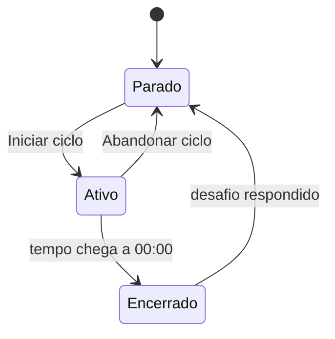

# Spec 01: Ciclo de foco

**Status**: implementado · **Prefixo**: `CIC`

## Objetivo

Dar ao usuário um bloco de tempo delimitado para trabalhar com foco. O fim do bloco é o gatilho para a pausa ativa (ver [02-desafios.md](02-desafios.md)).

## Histórias de usuário

- Como usuário, quero iniciar um ciclo com um clique para começar a trabalhar sem configurar nada.
- Como usuário, quero ver quanto tempo falta para saber quando vem a pausa.
- Como usuário, quero abandonar um ciclo que não vou conseguir terminar, sem ser penalizado.

## Requisitos

| ID     | Requisito                                                                                                                              |
| ------ | -------------------------------------------------------------------------------------------------------------------------------------- |
| CIC-01 | Um ciclo dura 35 minutos.                                                                                                              |
| CIC-02 | Com o ciclo parado, o sistema exibe `35:00` e o botão **Iniciar ciclo**.                                                               |
| CIC-03 | Quando o usuário clica em **Iniciar ciclo**, o sistema inicia a contagem regressiva, de segundo em segundo.                            |
| CIC-04 | O tempo restante é exibido no formato `MM:SS`, com um dígito por caixa.                                                                |
| CIC-05 | Durante um ciclo ativo, o sistema exibe o botão **Abandonar ciclo** no lugar de **Iniciar ciclo**.                                     |
| CIC-06 | Quando o usuário clica em **Abandonar ciclo**, o sistema para a contagem e volta para `35:00`, sem gerar desafio nem alterar o xp.     |
| CIC-07 | Quando a contagem chega a `00:00`, o sistema encerra o ciclo e dispara o sorteio de um desafio.                                        |
| CIC-08 | Com o ciclo encerrado, o sistema troca o relógio pelo desafio e orienta a resolvê-lo para liberar o próximo ciclo.                          |
| CIC-09 | Quando o usuário responde ao desafio (**Falhei** ou **Completei**), o sistema volta ao estado parado em `35:00`.                       |
| CIC-10 | A contagem se guia pelo horário de término, não por um segundo por timer: aba em segundo plano não alonga o ciclo.                  |
| CIC-11 | Com a contagem em andamento (ciclo ou pausa), o tempo restante aparece no título da aba, no formato `MM:SS · move.it`.                |

### Estados

## Critérios de aceite

**Iniciar um ciclo**
- Dado que o ciclo está parado em `35:00`
- Quando clico em **Iniciar ciclo**
- Então o mostrador passa a `34:59` após um segundo e o botão vira **Abandonar ciclo**

**Abandonar um ciclo**
- Dado que há um ciclo ativo
- Quando clico em **Abandonar ciclo**
- Então o mostrador volta a `35:00`, o botão vira **Iniciar ciclo** e nenhum desafio aparece

**Encerrar um ciclo**
- Dado que há um ciclo ativo com `00:01` restante
- Quando passa um segundo
- Então o mostrador exibe `00:00`, o botão vira **Ciclo encerrado** (desabilitado) e um desafio aparece

**Liberar um novo ciclo**
- Dado que o ciclo está encerrado e há um desafio na tela
- Quando clico em **Falhei** ou **Completei**
- Então o mostrador volta a `35:00` e o botão **Iniciar ciclo** fica disponível

## Design técnico

- **Estado**: `CountdownProvider` em [src/contexts/countdown-context.tsx](../../src/contexts/countdown-context.tsx) guarda `time` (segundos restantes), `isActive` e `hasFinished`. `minutes` e `seconds` são derivados de `time`.
- **Contagem**: com o ciclo (ou a pausa) em andamento, um `setInterval` de 250 ms recalcula `time` a partir de `endAt` (`Date.now()` + segundos restantes ao começar ou retomar). Pausar guarda o que restou em `time`; retomar recalcula `endAt`.
- **Fim do ciclo**: com `time === 0`, o efeito marca `hasFinished`, desativa o ciclo e chama `startNewChallenge` do `ChallengesProvider`. Por isso o `CountdownProvider` precisa ficar dentro do `ChallengesProvider`.
- **Interface**: [src/components/countdown.tsx](../../src/components/countdown.tsx) renderiza o mostrador e escolhe o botão conforme `hasFinished` e `isActive`.
- **Reset**: `resetCountdown` é chamado pelo botão **Abandonar ciclo**; o desafio é respondido em [src/components/cycle-challenge.tsx](../../src/components/cycle-challenge.tsx).

## Fora de escopo

- Pausar e retomar um ciclo: só existe abandonar.
- Intervalos cronometrados (pausa curta e longa do Pomodoro clássico): a pausa é o desafio, sem duração controlada.
- Histórico de ciclos concluídos ou abandonados.

## Questões em aberto

1. **Duração configurável**: os 35 minutos são fixos no código (há um `TODO` para um campo de seleção). O usuário deve poder escolher a duração? Com quais limites?
2. **Recarregar a página perde o ciclo**: o estado vive só na memória do navegador. O ciclo em andamento deve sobreviver a um reload?
