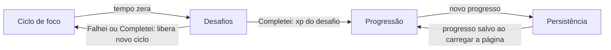

# Specs do produto

Especificações das features principais do Move.it 2. Cada spec descreve o comportamento que o produto entrega hoje e serve como fonte de verdade para mudanças futuras: altere a spec primeiro, depois o código.

Antes de propor qualquer mudança, leia os [guardrails do produto](00-guardrails.md): eles definem o núcleo que deve ser preservado e os limites do que o Move.it pode virar. Em caso de conflito, os guardrails prevalecem sobre as specs de feature.

| Spec                                              | Feature                                                        | Prefixo |
| ------------------------------------------------- | -------------------------------------------------------------- | ------- |
| [01-ciclo-de-foco.md](01-ciclo-de-foco.md)         | Cronômetro Pomodoro: iniciar, abandonar e encerrar um ciclo    | `CIC`   |
| [02-desafios.md](02-desafios.md)                   | Sorteio, exibição e resposta ao desafio ao fim do ciclo        | `DES`   |
| [03-progressao.md](03-progressao.md)               | Experiência, levels, barra de xp e modal de level up           | `PRO`   |
| [04-persistencia.md](04-persistencia.md)           | Gravação e leitura do progresso do usuário                     | `PER`   |
| [05-sistema-m.md](05-sistema-m.md)                 | Sistema M: pilares, foco atual e Inbox           | —       |

## Como as features se encaixam

## Estrutura de cada spec

- **Objetivo**: o problema do usuário que a feature resolve.
- **Histórias de usuário**: quem quer o quê e por quê.
- **Requisitos**: comportamento esperado, um por identificador (`CIC-01`, `DES-03`...). Todos os requisitos listados estão implementados.
- **Critérios de aceite**: cenários Dado/Quando/Então que validam os requisitos.
- **Design técnico**: onde o comportamento vive no código.
- **Fora de escopo**: o que a feature não faz por decisão atual.
- **Questões em aberto**: lacunas encontradas no comportamento atual, à espera de decisão de produto.

## Convenções

- Ao mudar um comportamento, atualize o requisito correspondente no mesmo commit.
- Um requisito novo recebe o próximo número livre do prefixo; números não são reaproveitados.
- Quando uma questão em aberto for decidida, ela sai da lista e vira requisito ou item de fora de escopo.
- O repositório não tem testes automatizados: os critérios de aceite são validados manualmente.
